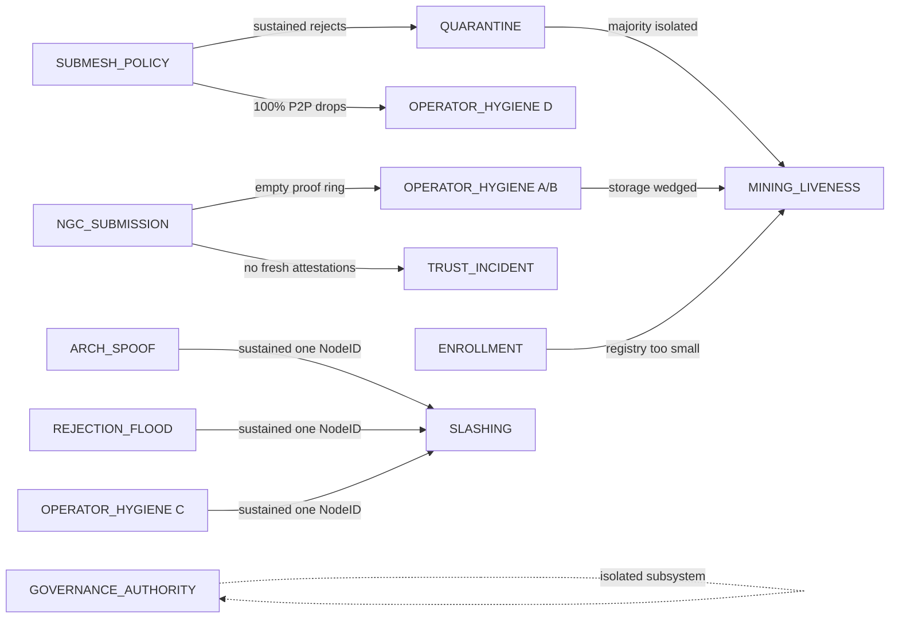

# QSDM Operator Runbooks — Master Index

This is the operator's first page when paged for any
`QSDM*` Prometheus alert. It lists all 38 alerts in
[`alerts_qsdm.example.yml`](../../../deploy/prometheus/alerts_qsdm.example.yml),
maps each to its dedicated runbook section, and shows
the cross-subsystem escalation paths in one place.

> **Coverage invariant.** Every alert in
> [`alerts_qsdm.example.yml`](../../../deploy/prometheus/alerts_qsdm.example.yml)
> carries an anchored `runbook_url`, and every
> `runbook_url` resolves to an existing markdown
> anchor. This is enforced in CI by
> [`scripts/check_runbook_coverage.py`](../../../../scripts/check_runbook_coverage.py)
> via the `runbook-coverage` job in
> [`.github/workflows/validate-deploy.yml`](../../../../.github/workflows/validate-deploy.yml).
> A PR that adds an alert without a resolvable
> `runbook_url`, or breaks an existing anchor, fails
> CI before merge.

## How to use this page

- **Paged for an alert?** Jump to the alphabetized
  table in [§1](#1-alert--runbook-anchor-master-table)
  and click the alert name. The link lands you on
  the exact `### 3.x Mode X — <alert>` triage section
  of the right runbook.
- **Want to learn the runbook surface area?** Read
  [§2 Per-runbook subsystem cards](#2-per-runbook-subsystem-cards) —
  each card names the subsystem, the alerts it
  covers, the canonical "when to read this" sentence,
  and the companion runbooks.
- **Investigating a multi-alert cascade?** [§3 Cross-
  runbook escalation map](#3-cross-runbook-escalation-map)
  shows the upstream/downstream relationships in a
  single mermaid diagram + the canonical concurrent-
  alert patterns.
- **Onboarding to on-call?** Read §1 once to see the
  full alert surface, then §2 in subsystem order,
  then §3 to internalize the escalation mesh.

---

## 1. Alert ↔ runbook anchor master table

Alphabetized by alert name. **Severity** column is
authoritative (matches `labels.severity` in the
alerts file). **Triage section** is a click-through
link directly to the relevant `### 3.x Mode X` (or
§7.x in REJECTION_FLOOD) anchor.

| Alert | Severity | Group | Triage section |
|---|---|---|---|
| `QSDMAttestArchSpoofCCSubjectMismatch`         | **critical** | `qsdm-v2-attest-archspoof`        | [`ARCH_SPOOF_INCIDENT.md` §3.3](ARCH_SPOOF_INCIDENT.md#33-mode-c--qsdmattestarchspoofccsubjectmismatch) |
| `QSDMAttestArchSpoofGPUNameMismatch`           | warning      | `qsdm-v2-attest-archspoof`        | [`ARCH_SPOOF_INCIDENT.md` §3.2](ARCH_SPOOF_INCIDENT.md#32-mode-b--qsdmattestarchspoofgpunamemismatch) |
| `QSDMAttestArchSpoofUnknownArchBurst`          | warning      | `qsdm-v2-attest-archspoof`        | [`ARCH_SPOOF_INCIDENT.md` §3.1](ARCH_SPOOF_INCIDENT.md#31-mode-a--qsdmattestarchspoofunknownarchburst) |
| `QSDMAttestHashrateOutOfBand`                  | warning      | `qsdm-v2-attest-hashrate`         | [`OPERATOR_HYGIENE_INCIDENT.md` §3.3](OPERATOR_HYGIENE_INCIDENT.md#33-mode-c--qsdmattesthashrateoutofband) |
| `QSDMAttestRejectionFieldRunesMaxNearCap`      | info         | `qsdm-v2-attest-recent-rejections`| [`REJECTION_FLOOD.md` §7.5](REJECTION_FLOOD.md#75-mode-e--qsdmattestrejectionfieldrunesmaxnearcap) |
| `QSDMAttestRejectionFieldTruncationSustained`  | warning      | `qsdm-v2-attest-recent-rejections`| [`REJECTION_FLOOD.md` §7.4](REJECTION_FLOOD.md#74-mode-d--qsdmattestrejectionfieldtruncationsustained) |
| `QSDMAttestRejectionPerMinerRateLimited`       | warning      | `qsdm-v2-attest-recent-rejections`| [`REJECTION_FLOOD.md` §7.3](REJECTION_FLOOD.md#73-mode-c--qsdmattestrejectionperminerratelimited) |
| `QSDMAttestRejectionPersistCompactionsHigh`    | warning      | `qsdm-v2-attest-recent-rejections`| [`REJECTION_FLOOD.md` §7.1](REJECTION_FLOOD.md#71-mode-a--qsdmattestrejectionpersistcompactionshigh) |
| `QSDMAttestRejectionPersistHardCapDropping`    | warning      | `qsdm-v2-attest-recent-rejections`| [`REJECTION_FLOOD.md` §7.2](REJECTION_FLOOD.md#72-mode-b--qsdmattestrejectionpersisthardcapdropping) |
| `QSDMGovAuthorityCountTooLow`                  | **critical** | `qsdm-v2-governance`              | [`GOVERNANCE_AUTHORITY_INCIDENT.md` §3.3](GOVERNANCE_AUTHORITY_INCIDENT.md#33-mode-c--qsdmgovauthoritycounttoolow) |
| `QSDMGovAuthorityThresholdCrossed`             | warning      | `qsdm-v2-governance`              | [`GOVERNANCE_AUTHORITY_INCIDENT.md` §3.2](GOVERNANCE_AUTHORITY_INCIDENT.md#32-mode-b--qsdmgovauthoritythresholdcrossed) |
| `QSDMGovAuthorityVoteRecorded`                 | info         | `qsdm-v2-governance`              | [`GOVERNANCE_AUTHORITY_INCIDENT.md` §3.1](GOVERNANCE_AUTHORITY_INCIDENT.md#31-mode-a--qsdmgovauthorityvoterecorded) |
| `QSDMMiningAutoRevokeBurst`                    | **critical** | `qsdm-v2-mining-slashing`         | [`SLASHING_INCIDENT.md` §3.4](SLASHING_INCIDENT.md#34-mode-d--qsdmminingautorevokeburst) |
| `QSDMMiningBondedDustDropped`                  | warning      | `qsdm-v2-mining-enrollment`       | [`ENROLLMENT_INCIDENT.md` §3.5](ENROLLMENT_INCIDENT.md#35-mode-e--qsdmminingbondeddustdropped) |
| `QSDMMiningChainStuck`                         | **critical** | `qsdm-v2-mining-liveness`         | [`MINING_LIVENESS.md` §3.1](MINING_LIVENESS.md#31-mode-a--qsdmminingchainstuck) |
| `QSDMMiningEnrollmentRejectionsBurst`          | warning      | `qsdm-v2-mining-enrollment`       | [`ENROLLMENT_INCIDENT.md` §3.4](ENROLLMENT_INCIDENT.md#34-mode-d--qsdmminingenrollmentrejectionsburst) |
| `QSDMMiningMempoolBacklog`                     | warning      | `qsdm-v2-mining-liveness`         | [`MINING_LIVENESS.md` §3.2](MINING_LIVENESS.md#32-mode-b--qsdmminingmempoolbacklog) |
| `QSDMMiningPendingUnbondMajority`              | warning      | `qsdm-v2-mining-enrollment`       | [`ENROLLMENT_INCIDENT.md` §3.3](ENROLLMENT_INCIDENT.md#33-mode-c--qsdmminingpendingunbondmajority) |
| `QSDMMiningRegistryEmpty`                      | warning      | `qsdm-v2-mining-enrollment`       | [`ENROLLMENT_INCIDENT.md` §3.1](ENROLLMENT_INCIDENT.md#31-mode-a--qsdmminingregistryempty) |
| `QSDMMiningRegistryShrinkingFast`              | warning      | `qsdm-v2-mining-enrollment`       | [`ENROLLMENT_INCIDENT.md` §3.2](ENROLLMENT_INCIDENT.md#32-mode-b--qsdmminingregistryshrinkingfast) |
| `QSDMMiningSlashApplied`                       | warning      | `qsdm-v2-mining-slashing`         | [`SLASHING_INCIDENT.md` §3.1](SLASHING_INCIDENT.md#31-mode-a--qsdmminingslashapplied) |
| `QSDMMiningSlashedDustBurst`                   | **critical** | `qsdm-v2-mining-slashing`         | [`SLASHING_INCIDENT.md` §3.2](SLASHING_INCIDENT.md#32-mode-b--qsdmminingslasheddustburst) |
| `QSDMMiningSlashRejectionsBurst`               | warning      | `qsdm-v2-mining-slashing`         | [`SLASHING_INCIDENT.md` §3.3](SLASHING_INCIDENT.md#33-mode-c--qsdmminingslashrejectionsburst) |
| `QSDMNGCChallengeRateLimited`                  | warning      | `qsdm-nvidia-lock`                | [`NGC_SUBMISSION_INCIDENT.md` §3.1](NGC_SUBMISSION_INCIDENT.md#31-mode-a--qsdmngcchallengeratelimited) |
| `QSDMNGCProofIngestRejectBurst`                | warning      | `qsdm-nvidia-lock`                | [`NGC_SUBMISSION_INCIDENT.md` §3.2](NGC_SUBMISSION_INCIDENT.md#32-mode-b--qsdmngcproofingestrejectburst) |
| `QSDMNoTransactionsStored`                     | warning      | `qsdm-throughput`                 | [`OPERATOR_HYGIENE_INCIDENT.md` §3.4](OPERATOR_HYGIENE_INCIDENT.md#34-mode-d--qsdmnotransactionsstored) |
| `QSDMNvidiaLockHTTPBlocksSpike`                | warning      | `qsdm-nvidia-lock`                | [`OPERATOR_HYGIENE_INCIDENT.md` §3.1](OPERATOR_HYGIENE_INCIDENT.md#31-mode-a--qsdmnvidialockhttpblocksspike) |
| `QSDMNvidiaLockP2PRejects`                     | warning      | `qsdm-nvidia-lock`                | [`OPERATOR_HYGIENE_INCIDENT.md` §3.2](OPERATOR_HYGIENE_INCIDENT.md#32-mode-b--qsdmnvidialockp2prejects) |
| `QSDMQuarantineAnySubmesh`                     | warning      | `qsdm-quarantine`                 | [`QUARANTINE_INCIDENT.md` §3.1](QUARANTINE_INCIDENT.md#31-mode-a--qsdmquarantineanysubmesh) |
| `QSDMQuarantineMajorityIsolated`               | **critical** | `qsdm-quarantine`                 | [`QUARANTINE_INCIDENT.md` §3.2](QUARANTINE_INCIDENT.md#32-mode-b--qsdmquarantinemajorityisolated) |
| `QSDMSubmeshAPISustained422`                   | warning      | `qsdm-submesh`                    | [`SUBMESH_POLICY_INCIDENT.md` §3.2](SUBMESH_POLICY_INCIDENT.md#32-mode-b--qsdmsubmeshapisustained422) |
| `QSDMSubmeshP2PRejects`                        | warning      | `qsdm-submesh`                    | [`SUBMESH_POLICY_INCIDENT.md` §3.1](SUBMESH_POLICY_INCIDENT.md#31-mode-a--qsdmsubmeshp2prejects) |
| `QSDMTrustAggregatorStale`                     | **critical** | `qsdm-trust-redundancy`           | [`TRUST_INCIDENT.md` §3.6](TRUST_INCIDENT.md#36-mode-f--qsdmtrustaggregatorstale) |
| `QSDMTrustAttestationsBelowFloor`              | warning      | `qsdm-trust-redundancy`           | [`TRUST_INCIDENT.md` §3.3](TRUST_INCIDENT.md#33-mode-c--qsdmtrustattestationsbelowfloor) |
| `QSDMTrustIngestRejectRateElevated`            | warning      | `qsdm-trust-transparency`         | [`TRUST_INCIDENT.md` §3.2](TRUST_INCIDENT.md#32-mode-b--qsdmtrustingestrejectrateelevated) |
| `QSDMTrustLastAttestedStale`                   | warning      | `qsdm-trust-redundancy`           | [`TRUST_INCIDENT.md` §3.5](TRUST_INCIDENT.md#35-mode-e--qsdmtrustlastattestedstale) |
| `QSDMTrustNGCServiceDegraded`                  | warning      | `qsdm-trust-redundancy`           | [`TRUST_INCIDENT.md` §3.4](TRUST_INCIDENT.md#34-mode-d--qsdmtrustngcservicedegraded) |
| `QSDMTrustNoAttestationsAccepted`              | warning      | `qsdm-trust-transparency`         | [`TRUST_INCIDENT.md` §3.1](TRUST_INCIDENT.md#31-mode-a--qsdmtrustnoattestationsaccepted) |

**Total: 38 alerts. Severity distribution: 7 critical
/ 29 warning / 2 info.**

---

## 2. Per-runbook subsystem cards

One card per runbook, in subsystem-cluster order
(loosely: chain liveness → mining lifecycle →
attestation defence → trust pipeline → governance →
operational hygiene). Each card lists alerts
covered, the canonical "when to read this" framing,
and bidirectional companions.

### `MINING_LIVENESS.md` — chain-liveness sentinels

The keystone runbook. Catches cases where the chain
**stops producing blocks** (`QSDMMiningChainStuck`)
or where mempool backlog is climbing without
correspondingly higher block production
(`QSDMMiningMempoolBacklog`).

| Alert | Mode | Severity |
|---|---|---|
| [`QSDMMiningChainStuck`](MINING_LIVENESS.md#31-mode-a--qsdmminingchainstuck)         | A | **critical** |
| [`QSDMMiningMempoolBacklog`](MINING_LIVENESS.md#32-mode-b--qsdmminingmempoolbacklog) | B | warning      |

**When to read:** an "is the chain alive?" page. If
`QSDMMiningChainStuck` is firing, all other alerts
are downstream symptoms — fix this first.

**Companions:** [`ENROLLMENT_INCIDENT.md`](ENROLLMENT_INCIDENT.md)
(registry too small to produce blocks),
[`QUARANTINE_INCIDENT.md`](QUARANTINE_INCIDENT.md)
(majority of validators isolated),
[`OPERATOR_HYGIENE_INCIDENT.md`](OPERATOR_HYGIENE_INCIDENT.md)
(storage backend wedging block production).

---

### `ENROLLMENT_INCIDENT.md` — miner-registry health

Five-mode runbook for the v2 mining registry: empty
registry, fast shrinkage, pending-unbond majority,
enrollment-rejection burst, and bonded-dust drops.
Covers the miner-lifecycle bonding/unbonding
machinery.

| Alert | Mode | Severity |
|---|---|---|
| [`QSDMMiningRegistryEmpty`](ENROLLMENT_INCIDENT.md#31-mode-a--qsdmminingregistryempty)                       | A | warning |
| [`QSDMMiningRegistryShrinkingFast`](ENROLLMENT_INCIDENT.md#32-mode-b--qsdmminingregistryshrinkingfast)       | B | warning |
| [`QSDMMiningPendingUnbondMajority`](ENROLLMENT_INCIDENT.md#33-mode-c--qsdmminingpendingunbondmajority)       | C | warning |
| [`QSDMMiningEnrollmentRejectionsBurst`](ENROLLMENT_INCIDENT.md#34-mode-d--qsdmminingenrollmentrejectionsburst) | D | warning |
| [`QSDMMiningBondedDustDropped`](ENROLLMENT_INCIDENT.md#35-mode-e--qsdmminingbondeddustdropped)               | E | warning |

**When to read:** registry-side anomaly. Mode A is
the upstream cause for several `MINING_LIVENESS`
escalations.

**Companions:** [`MINING_LIVENESS.md`](MINING_LIVENESS.md),
[`SLASHING_INCIDENT.md`](SLASHING_INCIDENT.md)
(slashing → auto-revoke → registry shrinkage),
[`ARCH_SPOOF_INCIDENT.md`](ARCH_SPOOF_INCIDENT.md)
(Mode B's hardware-swap branch flows through the
unenroll → unbond → re-enroll cycle).

---

### `SLASHING_INCIDENT.md` — economic punishment

Four-mode runbook for v2 slashing events. Covers
the per-event slash, dust-burst aggregate, slash-
rejection burst (slashes proposed but failing), and
auto-revoke burst (NodeIDs being kicked out).

| Alert | Mode | Severity |
|---|---|---|
| [`QSDMMiningSlashApplied`](SLASHING_INCIDENT.md#31-mode-a--qsdmminingslashapplied)                 | A | warning      |
| [`QSDMMiningSlashedDustBurst`](SLASHING_INCIDENT.md#32-mode-b--qsdmminingslasheddustburst)         | B | **critical** |
| [`QSDMMiningSlashRejectionsBurst`](SLASHING_INCIDENT.md#33-mode-c--qsdmminingslashrejectionsburst) | C | warning      |
| [`QSDMMiningAutoRevokeBurst`](SLASHING_INCIDENT.md#34-mode-d--qsdmminingautorevokeburst)           | D | **critical** |

**When to read:** slashing activity is firing.
Mode B (dust-burst) and Mode D (auto-revoke) both
escalate to critical because they signal mass-cheat
detection.

**Companions:** [`ARCH_SPOOF_INCIDENT.md`](ARCH_SPOOF_INCIDENT.md),
[`REJECTION_FLOOD.md`](REJECTION_FLOOD.md),
[`OPERATOR_HYGIENE_INCIDENT.md`](OPERATOR_HYGIENE_INCIDENT.md)
(sustained Mode C arch-spoof + Mode C hashrate from
one NodeID is the canonical cross-axis cheat
slashing case).

---

### `ARCH_SPOOF_INCIDENT.md` — adversarial arch-claim defence

Three-mode runbook for the §4.6.2 arch-spoof family.
Detects miners lying about their hardware:
unknown_arch (typo or out-of-allowlist), gpu_name
mismatch (HMAC bundle contradicts claimed arch — the
economic-cheat case), and CC subject mismatch (CC
leaf cert subject contradicts claimed arch — the
cryptographic-anomaly case).

| Alert | Mode | Severity |
|---|---|---|
| [`QSDMAttestArchSpoofUnknownArchBurst`](ARCH_SPOOF_INCIDENT.md#31-mode-a--qsdmattestarchspoofunknownarchburst)   | A | warning      |
| [`QSDMAttestArchSpoofGPUNameMismatch`](ARCH_SPOOF_INCIDENT.md#32-mode-b--qsdmattestarchspoofgpunamemismatch)     | B | warning      |
| [`QSDMAttestArchSpoofCCSubjectMismatch`](ARCH_SPOOF_INCIDENT.md#33-mode-c--qsdmattestarchspoofccsubjectmismatch) | C | **critical** |

**When to read:** arch-spoof activity is firing.
Mode C is critical because Subject CN mismatches
are cryptographic anomalies, not operator typos.

**Companions:** [`SLASHING_INCIDENT.md`](SLASHING_INCIDENT.md),
[`REJECTION_FLOOD.md`](REJECTION_FLOOD.md),
[`ENROLLMENT_INCIDENT.md`](ENROLLMENT_INCIDENT.md),
[`OPERATOR_HYGIENE_INCIDENT.md`](OPERATOR_HYGIENE_INCIDENT.md).

---

### `REJECTION_FLOOD.md` — §4.6 attestation rejection ring

Five-mode runbook for the rejection-ring forensic
store + plumbing health. Modes A/B catch the persister's
hard-cap defences (compaction churn / hard-cap drops),
Mode C catches per-miner rate-limiting, Modes D/E
catch field-truncation and rune-cap pressure.

> **Note:** alert anchors here are at §7.x (not §3.x)
> because §3 in this runbook is the multi-step
> operator triage matrix; §7 is the per-mode alert
> reference.

| Alert | Mode | Severity |
|---|---|---|
| [`QSDMAttestRejectionPersistCompactionsHigh`](REJECTION_FLOOD.md#71-mode-a--qsdmattestrejectionpersistcompactionshigh)     | A | warning |
| [`QSDMAttestRejectionPersistHardCapDropping`](REJECTION_FLOOD.md#72-mode-b--qsdmattestrejectionpersisthardcapdropping)     | B | warning |
| [`QSDMAttestRejectionPerMinerRateLimited`](REJECTION_FLOOD.md#73-mode-c--qsdmattestrejectionperminerratelimited)           | C | warning |
| [`QSDMAttestRejectionFieldTruncationSustained`](REJECTION_FLOOD.md#74-mode-d--qsdmattestrejectionfieldtruncationsustained) | D | warning |
| [`QSDMAttestRejectionFieldRunesMaxNearCap`](REJECTION_FLOOD.md#75-mode-e--qsdmattestrejectionfieldrunesmaxnearcap)         | E | info    |

**When to read:** the §4.6 rejection ring is showing
plumbing pressure (Modes A/B/C) or field-shape
pressure (Modes D/E). Modes D/E are usually
sustained-attack signals.

**Companions:** [`SLASHING_INCIDENT.md`](SLASHING_INCIDENT.md),
[`ARCH_SPOOF_INCIDENT.md`](ARCH_SPOOF_INCIDENT.md).

---

### `TRUST_INCIDENT.md` — qsdm.tech transparency aggregate

Six-mode runbook for the trust subsystem's *aggregate
response* alerts. Catches cases where the validator's
view of the qsdm.tech transparency pipeline degrades:
no attestations accepted, ingest reject rate
elevated, attestations below floor, NGC service
degraded, last-attested stale, aggregator stale.

| Alert | Mode | Severity |
|---|---|---|
| [`QSDMTrustNoAttestationsAccepted`](TRUST_INCIDENT.md#31-mode-a--qsdmtrustnoattestationsaccepted)         | A | warning      |
| [`QSDMTrustIngestRejectRateElevated`](TRUST_INCIDENT.md#32-mode-b--qsdmtrustingestrejectrateelevated)     | B | warning      |
| [`QSDMTrustAttestationsBelowFloor`](TRUST_INCIDENT.md#33-mode-c--qsdmtrustattestationsbelowfloor)         | C | warning      |
| [`QSDMTrustNGCServiceDegraded`](TRUST_INCIDENT.md#34-mode-d--qsdmtrustngcservicedegraded)                 | D | warning      |
| [`QSDMTrustLastAttestedStale`](TRUST_INCIDENT.md#35-mode-e--qsdmtrustlastattestedstale)                   | E | warning      |
| [`QSDMTrustAggregatorStale`](TRUST_INCIDENT.md#36-mode-f--qsdmtrustaggregatorstale)                       | F | **critical** |

**When to read:** trust-degradation is firing. This
is the *aggregate-response* runbook;
[`NGC_SUBMISSION_INCIDENT.md`](NGC_SUBMISSION_INCIDENT.md)
is the *per-request gate* upstream cause.

**Companions:** [`NGC_SUBMISSION_INCIDENT.md`](NGC_SUBMISSION_INCIDENT.md)
(upstream cause, bidirectional cross-links from
Modes A/B/D).

---

### `NGC_SUBMISSION_INCIDENT.md` — qsdm.tech transparency per-request gate

Two-mode runbook for the NGC submission gate. Mode A
catches `GET /monitoring/ngc-challenge` rate-limit
hits (15 req/IP/min). Mode B catches
`POST /monitoring/ngc-proof` ingest reject bursts
across the nine closed-enum reject reasons
(`hmac` / `nonce` / `unauthorized` / `body_read` /
`body_too_large` / `invalid_json` / `missing_cuda_hash`
/ `ingest_disabled` / `other`).

| Alert | Mode | Severity |
|---|---|---|
| [`QSDMNGCChallengeRateLimited`](NGC_SUBMISSION_INCIDENT.md#31-mode-a--qsdmngcchallengeratelimited)     | A | warning |
| [`QSDMNGCProofIngestRejectBurst`](NGC_SUBMISSION_INCIDENT.md#32-mode-b--qsdmngcproofingestrejectburst) | B | warning |

**When to read:** the per-request submission gate is
seeing elevated reject rates. This is the
*upstream cause* for both [`TRUST_INCIDENT.md`](TRUST_INCIDENT.md)
(no fresh attestations) and
[`OPERATOR_HYGIENE_INCIDENT.md`](OPERATOR_HYGIENE_INCIDENT.md)
Modes A/B (NVIDIA-lock proof ring empty).

**Companions:** [`TRUST_INCIDENT.md`](TRUST_INCIDENT.md),
[`OPERATOR_HYGIENE_INCIDENT.md`](OPERATOR_HYGIENE_INCIDENT.md).

---

### `QUARANTINE_INCIDENT.md` — submesh isolation events

Two-mode runbook for the mesh's immune system. Mode A
catches per-submesh isolation, Mode B catches the
critical case where a majority of submeshes are
isolated simultaneously (consensus-stall risk).

| Alert | Mode | Severity |
|---|---|---|
| [`QSDMQuarantineAnySubmesh`](QUARANTINE_INCIDENT.md#31-mode-a--qsdmquarantineanysubmesh)             | A | warning      |
| [`QSDMQuarantineMajorityIsolated`](QUARANTINE_INCIDENT.md#32-mode-b--qsdmquarantinemajorityisolated) | B | **critical** |

**When to read:** quarantine activity is firing.
Mode B is critical because majority isolation can
wedge consensus.

**Companions:** [`SUBMESH_POLICY_INCIDENT.md`](SUBMESH_POLICY_INCIDENT.md)
(upstream per-tx cause; quarantine is the aggregate
response),
[`MINING_LIVENESS.md`](MINING_LIVENESS.md)
(quarantine majority → consensus stall).

---

### `SUBMESH_POLICY_INCIDENT.md` — per-tx submesh policy gate

Two-mode runbook for the submesh policy enforcement
layer (route + size caps). Mode A catches P2P-side
rejects, Mode B catches the API-side sustained 422s.

| Alert | Mode | Severity |
|---|---|---|
| [`QSDMSubmeshP2PRejects`](SUBMESH_POLICY_INCIDENT.md#31-mode-a--qsdmsubmeshp2prejects)            | A | warning |
| [`QSDMSubmeshAPISustained422`](SUBMESH_POLICY_INCIDENT.md#32-mode-b--qsdmsubmeshapisustained422)  | B | warning |

**When to read:** policy-gate rejects are climbing.
This is the per-request gate; sustained activity
escalates to [`QUARANTINE_INCIDENT.md`](QUARANTINE_INCIDENT.md).

**Companions:** [`QUARANTINE_INCIDENT.md`](QUARANTINE_INCIDENT.md),
[`MINING_LIVENESS.md`](MINING_LIVENESS.md),
[`REJECTION_FLOOD.md`](REJECTION_FLOOD.md),
[`OPERATOR_HYGIENE_INCIDENT.md`](OPERATOR_HYGIENE_INCIDENT.md)
(when submesh-policy rejects 100% of P2P traffic,
the throughput sentinel co-fires).

---

### `GOVERNANCE_AUTHORITY_INCIDENT.md` — multisig authority rotation

Three-mode runbook for the constitutional layer. Mode
A is the per-vote info ping (intentionally low-noise
— just so other authority members see the vote
happened), Mode B catches threshold crossings (M-of-N
about to flip), Mode C is the critical case where the
authority count drops below the operating minimum.

| Alert | Mode | Severity |
|---|---|---|
| [`QSDMGovAuthorityVoteRecorded`](GOVERNANCE_AUTHORITY_INCIDENT.md#31-mode-a--qsdmgovauthorityvoterecorded)         | A | info         |
| [`QSDMGovAuthorityThresholdCrossed`](GOVERNANCE_AUTHORITY_INCIDENT.md#32-mode-b--qsdmgovauthoritythresholdcrossed) | B | warning      |
| [`QSDMGovAuthorityCountTooLow`](GOVERNANCE_AUTHORITY_INCIDENT.md#33-mode-c--qsdmgovauthoritycounttoolow)           | C | **critical** |

**When to read:** multisig rotation activity. Mode A
is informational ("hey, a vote happened"); Mode C is
the critical case requiring immediate governance
intervention.

**Companions:** governance-authority is operationally
isolated from the data-plane runbooks — no direct
cascade companions.

---

### `OPERATOR_HYGIENE_INCIDENT.md` — bundled finishing runbook

Four-mode runbook bundling alerts that share three
properties: operationally adjacent to v1 NVIDIA-lock
or v2 throughput sentinels, resolvable by the on-call
alone without escalation, and lower-frequency than
cascade alerts.

| Alert | Mode | Severity |
|---|---|---|
| [`QSDMNvidiaLockHTTPBlocksSpike`](OPERATOR_HYGIENE_INCIDENT.md#31-mode-a--qsdmnvidialockhttpblocksspike) | A | warning |
| [`QSDMNvidiaLockP2PRejects`](OPERATOR_HYGIENE_INCIDENT.md#32-mode-b--qsdmnvidialockp2prejects)           | B | warning |
| [`QSDMAttestHashrateOutOfBand`](OPERATOR_HYGIENE_INCIDENT.md#33-mode-c--qsdmattesthashrateoutofband)     | C | warning |
| [`QSDMNoTransactionsStored`](OPERATOR_HYGIENE_INCIDENT.md#34-mode-d--qsdmnotransactionsstored)           | D | warning |

**When to read:** any of the four hygiene alerts is
firing. Mode D is the keystone "silent failure"
sentinel — the chain is admitting txs but storing
zero of them; the runbook decomposes by which gate
is rejecting 100% of traffic.

**Companions:**
[`NGC_SUBMISSION_INCIDENT.md`](NGC_SUBMISSION_INCIDENT.md)
(NVIDIA-lock proof ring upstream),
[`SUBMESH_POLICY_INCIDENT.md`](SUBMESH_POLICY_INCIDENT.md)
(alternate cause for Mode D),
[`ARCH_SPOOF_INCIDENT.md`](ARCH_SPOOF_INCIDENT.md)
(Mode C cross-references arch-spoof).

---

## 3. Cross-runbook escalation map

The runbooks form a cascade mesh. Upstream causes
sit on the left; downstream symptoms sit on the
right. Sustained activity in an upstream runbook
typically causes the downstream alerts to fire as
follow-on signals, so triaging the upstream first
is the correct order.



### Canonical concurrent-alert patterns

| Concurrent alerts | Most likely root | First-fix runbook |
|---|---|---|
| `QSDMNGCProofIngestRejectBurst` + any `QSDMTrust*` | NGC ingest rejecting bundles → no fresh attestations → trust degrades | [`NGC_SUBMISSION_INCIDENT.md` §3.2](NGC_SUBMISSION_INCIDENT.md#32-mode-b--qsdmngcproofingestrejectburst) |
| `QSDMNGCProofIngestRejectBurst` + `QSDMNvidiaLock*Spike/Rejects` | NGC ingest rejecting bundles → empty NVIDIA-lock proof ring → both gates reject | [`NGC_SUBMISSION_INCIDENT.md` §3.2](NGC_SUBMISSION_INCIDENT.md#32-mode-b--qsdmngcproofingestrejectburst) |
| `QSDMSubmeshP2PRejects` + `QSDMQuarantineAnySubmesh` | Submesh-policy violations triggering quarantine | [`SUBMESH_POLICY_INCIDENT.md` §3.1](SUBMESH_POLICY_INCIDENT.md#31-mode-a--qsdmsubmeshp2prejects) |
| `QSDMSubmeshP2PRejects` + `QSDMNoTransactionsStored` | Submesh-policy rejecting 100% of P2P traffic | [`SUBMESH_POLICY_INCIDENT.md`](SUBMESH_POLICY_INCIDENT.md) |
| `QSDMQuarantineMajorityIsolated` + `QSDMMiningChainStuck` | Majority of validators isolated → consensus stalled | [`QUARANTINE_INCIDENT.md` §3.2](QUARANTINE_INCIDENT.md#32-mode-b--qsdmquarantinemajorityisolated) (then liveness clears as follow-on) |
| `QSDMMiningRegistryEmpty` + `QSDMMiningChainStuck` | Registry empty → no producers → chain stuck | [`ENROLLMENT_INCIDENT.md` §3.1](ENROLLMENT_INCIDENT.md#31-mode-a--qsdmminingregistryempty) |
| Any `QSDMAttestArchSpoof*` + `QSDMAttestHashrateOutOfBand` from same NodeID | Miner cheating across multiple axes | [`ARCH_SPOOF_INCIDENT.md`](ARCH_SPOOF_INCIDENT.md) → [`SLASHING_INCIDENT.md`](SLASHING_INCIDENT.md) |
| `QSDMMiningSlashedDustBurst` + `QSDMMiningAutoRevokeBurst` + `QSDMMiningRegistryShrinkingFast` | Mass-cheat detection event | [`SLASHING_INCIDENT.md` §3.2](SLASHING_INCIDENT.md#32-mode-b--qsdmminingslasheddustburst) |
| `QSDMMiningChainStuck` only | Storage backend wedging block production | [`OPERATOR_HYGIENE_INCIDENT.md` §3.4](OPERATOR_HYGIENE_INCIDENT.md#34-mode-d--qsdmnotransactionsstored) decomposition first; if storage clean, [`MINING_LIVENESS.md`](MINING_LIVENESS.md) |

---

## 4. Severity quick-views

### Critical (7) — page-out-of-bed

| Alert | Runbook | Why critical |
|---|---|---|
| `QSDMMiningChainStuck`                  | [`MINING_LIVENESS.md`](MINING_LIVENESS.md)                           | Chain stopped producing blocks |
| `QSDMQuarantineMajorityIsolated`        | [`QUARANTINE_INCIDENT.md`](QUARANTINE_INCIDENT.md)                   | Majority of validators isolated → consensus-stall risk |
| `QSDMTrustAggregatorStale`              | [`TRUST_INCIDENT.md`](TRUST_INCIDENT.md)                             | Aggregator hasn't published in too long |
| `QSDMMiningSlashedDustBurst`            | [`SLASHING_INCIDENT.md`](SLASHING_INCIDENT.md)                       | Mass-slash event in progress |
| `QSDMMiningAutoRevokeBurst`             | [`SLASHING_INCIDENT.md`](SLASHING_INCIDENT.md)                       | Mass auto-revocations |
| `QSDMAttestArchSpoofCCSubjectMismatch`  | [`ARCH_SPOOF_INCIDENT.md`](ARCH_SPOOF_INCIDENT.md)                   | CC leaf cert subject contradicts claimed arch — cryptographic anomaly |
| `QSDMGovAuthorityCountTooLow`           | [`GOVERNANCE_AUTHORITY_INCIDENT.md`](GOVERNANCE_AUTHORITY_INCIDENT.md)| Authority count below operating minimum |

### Warning (29) — investigate within shift

[See §1 master table](#1-alert--runbook-anchor-master-table) — 29 of the 38 entries are
severity `warning`.

### Info (2) — informational, no immediate action

| Alert | Runbook | Purpose |
|---|---|---|
| `QSDMGovAuthorityVoteRecorded`            | [`GOVERNANCE_AUTHORITY_INCIDENT.md`](GOVERNANCE_AUTHORITY_INCIDENT.md) | Authority members get a Slack-style ping that a vote happened, in case the coordinator forgot to ping them out-of-band |
| `QSDMAttestRejectionFieldRunesMaxNearCap` | [`REJECTION_FLOOD.md`](REJECTION_FLOOD.md)                            | Field rune-count is approaching the truncation cap; capacity-planning signal |

---

## 5. Coverage invariants enforced by CI

The following six invariants are guaranteed by
[`scripts/check_runbook_coverage.py`](../../../../scripts/check_runbook_coverage.py)
running in
[`.github/workflows/validate-deploy.yml`](../../../../.github/workflows/validate-deploy.yml)
on every push and PR that touches `QSDM/deploy/`,
`QSDM/docs/docs/runbooks/`, the lint script, or the
workflow itself.

**Alerts ↔ runbooks invariants** (the
38-alerts-have-resolvable-deep-links promise):

1. **Every alert in `alerts_qsdm.example.yml` carries
   a non-empty `runbook_url` annotation.** A PR
   adding an alert without one fails CI.
2. **Every `runbook_url` resolves to an existing
   file under `QSDM/docs/docs/runbooks/`.** A PR
   pointing at a missing or renamed runbook fails
   CI.
3. **Every `runbook_url` anchor exists in its target
   markdown file.** A PR renaming a section header
   without updating the anchors fails CI. The lint
   computes GitHub-flavoured anchor slugs from each
   `### N.M Mode X — \`alert\`` heading and matches
   them against the URL fragment.

**In-runbook navigation invariants** (the
no-broken-links-inside-the-runbook-tree promise; ~300
links validated):

4. **Every relative `[text](OTHER.md)` cross-runbook
   link in any runbook resolves to an existing
   markdown file.** A PR renaming a runbook without
   also updating every other runbook that links to
   it fails CI.
5. **Every `[text](OTHER.md#anchor)` and
   `[text](#anchor)` anchor target exists as a real
   markdown heading.** A PR renaming a section
   header (anywhere in the runbook tree) without
   updating the navigation links pointing at it
   fails CI. Intra-file anchors (`#anchor`) are
   checked against the same file's headings;
   cross-file anchors (`OTHER.md#anchor`) are
   checked against the target file's headings.
6. **Every `[text](../path/to/source.go)` (and other
   non-markdown) source-file reference in any
   runbook resolves to an existing path under the
   repo.** Covers Go source files, deploy
   manifests, scripts, workflows, and other repo
   artifacts. A PR moving or renaming a referenced
   file without updating runbook links fails CI.

External links (`http://`, `https://`, `mailto:`)
are skipped — the lint is offline-only. Links
inside fenced code blocks (` ``` … ``` `) are also
skipped, since they're documentation-of-syntax, not
navigation.

**If you add or rename an alert, a runbook, a
section header, or a referenced source file, update
both the source AND the dependent links in the same
PR — CI will catch the rest.**

---

## 6. Source files

- **Alerts:** [`QSDM/deploy/prometheus/alerts_qsdm.example.yml`](../../../deploy/prometheus/alerts_qsdm.example.yml)
- **Runbooks:** this directory (`QSDM/docs/docs/runbooks/`)
- **Coverage lint:** [`scripts/check_runbook_coverage.py`](../../../../scripts/check_runbook_coverage.py)
- **CI workflow:** [`.github/workflows/validate-deploy.yml`](../../../../.github/workflows/validate-deploy.yml)

---

## 7. Sweep history

The runbook coverage sweep landed across 7 commits
(visible on `main` between `9dd4a73` and the index
commit):

| # | Commit topic | Coverage delta |
|---|---|---|
| 1 | Slashing dashboard tile + `SLASHING_INCIDENT` runbook + 4 alert annotations | +4 (4/38) |
| 2 | Enrollment registry tile + `ENROLLMENT_INCIDENT` runbook + 5 alert annotations | +5 (9/38) |
| 3 | `MINING_LIVENESS.md` + 2 alert annotations | +2 (11/38) |
| 4 | `TRUST_INCIDENT.md` + 6 alert annotations | +6 (17/38) |
| 5 | Small-runbook sweep — quarantine + arch-spoof + rejection-plumbing (3 runbooks, 7 alerts) | +10 (27/38) |
| 6 | `SUBMESH_POLICY_INCIDENT.md` + 2 alerts                       | +2 (29/38) |
| 7 | `GOVERNANCE_AUTHORITY_INCIDENT.md` + 3 alerts                 | +3 (32/38) |
| 8 | `NGC_SUBMISSION_INCIDENT.md` + 2 alerts + TRUST cross-link backfill | +2 (34/38) |
| 9 | `OPERATOR_HYGIENE_INCIDENT.md` (4 modes) + 4 alerts → **100%** | +4 (38/38) |
| 10 | This index + CI coverage lint (regression guard) | invariant-lock |
