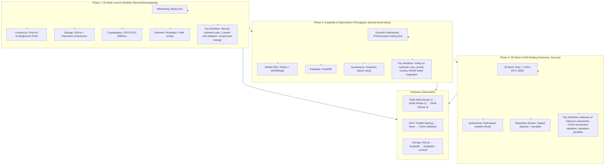

This project needs a lot of time and hardware requirements. Help me accomplish my goal of serving humanity new technology for better life. Buy me a coffee! >>
https://ko-fi.com/joedeldalioan

or send me some love via paypal or crypto >>

- **Paypal:** paypal.me/Dalioan
- **Bitcoin (Unisat):** bc1qu8pknsrwvssspq4c6a5j4p3x835phq8n3ajcgw
- **Solana:** FNEdD3PWMLwbNKxtaHy3W2NVfRJ7wqDNx4M9je8Xc6Mw
- **Tron:** TGVrpryTJAmWEPWTKYB3tGRv5gWhE2g9Lo
- **Metamask:** 0x9F32B8346bD728DF3AB7775971705D02fb86dD9c

# Quantum-Secure Dynamic Mesh Ledger (QSDM)

QSDM is a non-AI, decentralized electronic cash system designed with a focus on quantum security, modularity, and hardware efficiency. It relies on cryptographic protocols and algorithmic consensus without any AI or machine learning dependencies.

## Core Principles

- **No AI/ML Dependencies:** Uses cryptographic protocols and algorithmic consensus.
- **Hardware-Agnostic Design:** Optimized for mid-tier PCs (32GB RAM, GTX 3050, HDD).
- **Modular Architecture:** Easily extensible for future AI integration if desired.

## System Architecture

QSDM is developed in three phases, each focusing on different aspects of the system:

### Phase 1: 2D Mesh Launch (Stability, Manual Bootstrapping)

| Component          | Tech Stack                      | Description                                  | Hardware Use          |
|--------------------|--------------------------------|----------------------------------------------|----------------------|
| Networking         | libp2p (Go)                    | P2P gossip protocol for transaction broadcast | 8GB RAM, 2 CPU cores |
| Consensus          | Proof-of-Entanglement (PoE)    | Nodes validate 2 parent cells per transaction | GTX 3050 (parallel hashing) |
| Storage            | SQLite + Zstandard compression | Stores transactions with compression for HDD efficiency | 500GB HDD            |
| Cryptography       | CRYSTALS-Dilithium (Open Quantum Safe library) | Quantum-safe signatures for transactions | CPU-bound (4 threads) |
| Submesh Templates  | Predefined YAML config files   | Manual submesh creation (e.g., micropayments.yml) | Minimal overhead     |

**Key Workflow:**

- Users manually define submesh rules (e.g., fees, geographic tags) via YAML.
- Nodes validate transactions by checking 2 parent cells and signatures.
- Transactions are stored in SQLite with Zstandard compression.

### Phase 2: Scalability & Optimization (Throughput, Manual Governance)

| Component          | Tech Stack                      | Description                                  | Hardware Use          |
|--------------------|--------------------------------|----------------------------------------------|----------------------|
| Dynamic Submeshes  | Priority-based routing (Go)     | Manual rules for redirecting traffic (e.g., high-fee → fast lane) | 16GB RAM              |
| WASM SDK           | TinyGo + WASMEdge               | WASM modules for wallet/validator integration | 12GB RAM (WASM runtime) |
| Database           | ScyllaDB                       | Log-structured storage for high throughput   | 800GB HDD             |
| Governance         | Snapshot-based voting           | Token-weighted voting for submesh changes    | CPU-bound             |

**Key Workflow:**

- Node operators vote to adjust submesh rules (e.g., block size, fees).
- High-fee transactions are prioritized via manual routing tables.
- Developers use WASM SDK to build wallets without AI-generated code.

### Phase 3: 3D Mesh & Self-Healing (Autonomy, Security)

| Component          | Tech Stack                      | Description                                  | Hardware Use          |
|--------------------|--------------------------------|----------------------------------------------|----------------------|
| 3D Mesh            | Rust + CUDA (GTX 3050)          | Nodes validate 3–5 parent cells in a 3D web | GTX 3050 (parallel validation) |
| Quarantines        | Rule-based isolation (Rust)     | Nodes vote to isolate submeshes with >50% invalid transactions | 24GB RAM              |
| Reputation System  | Staked deposits + penalties     | Nodes lose stakes for invalid validations    | Minimal overhead      |

**Key Workflow:**

- Nodes detect malicious submeshes via manual thresholds (e.g., 50% invalid TXs).
- CUDA accelerates 3D PoE validation on GTX 3050.
- Reputation penalties deter bad actors.

## Visualization of QSDM

Below is a mermaid flowchart summarizing how the Quantum-Secure Dynamic Mesh Ledger (QSDM) works across its three development phases:

This modular and phased approach ensures stability, scalability, and security in a quantum-safe decentralized ledger system.

## Hardware Optimization

| Resource | Phase 1           | Phase 2                 | Phase 3                  |
|----------|-------------------|-------------------------|--------------------------|
| RAM      | 8GB (nodes)       | 16GB (WASM + ScyllaDB)  | 24GB (3D mesh)           |
| GPU      | Parallel hashing  | —                       | CUDA validation          |
| Storage  | SQLite (500GB HDD)| ScyllaDB (800GB HDD)    | ScyllaDB + archival      |

## Key Differences from AI-Driven QSDM

| Feature           | AI Version           | Non-AI Version          |
|-------------------|----------------------|------------------------|
| Submesh Balancing | AI predicts traffic  | Manual routing tables   |
| Attack Detection  | DeepSeek-R1 flags threats | Rule-based thresholds |
| Governance        | AI drafts proposals  | Community Snapshot voting |
| Complexity        | High (ML models)     | Moderate (YAML/configs) |

## Example Use Case

- Phase 1: A developer creates a "micropayments" submesh via YAML, sets low fees.
- Phase 2: Nodes vote to increase block size for this submesh during peak hours.
- Phase 3: Malicious nodes spamming the submesh are isolated via manual voting.

## Advantages

- Simpler Debugging: No black-box AI logic.
- Lower Resource Use: Eliminates GPU-heavy ML workloads.
- Transparency: Rules and thresholds are manually defined.

## Developer 👨‍💻

Developed by [Blackbeard](https://blackbeard.one) | [Ten Titanics](https://tentitanics.com) | [GitHub](https://github.com/blackbeardONE)

© 2023-2025 Blackbeard. All rights reserved.# QSDM
