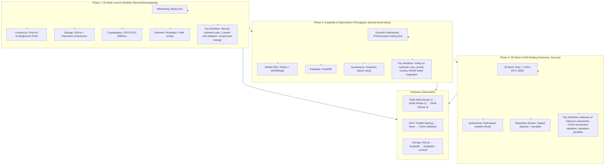

This project needs a lot of time and hardware requirements. Help me accomplish my goal of serving humanity new technology for better life. Buy me a coffee! >>
https://ko-fi.com/joedeldalioan

or send me some love via paypal or crypto >>

- **Paypal:** paypal.me/Dalioan
- **Bitcoin (Unisat):** bc1qu8pknsrwvssspq4c6a5j4p3x835phq8n3ajcgw
- **Solana:** FNEdD3PWMLwbNKxtaHy3W2NVfRJ7wqDNx4M9je8Xc6Mw
- **Tron:** TGVrpryTJAmWEPWTKYB3tGRv5gWhE2g9Lo
- **Metamask:** 0x9F32B8346bD728DF3AB7775971705D02fb86dD9c

# Quantum-Secure Dynamic Mesh Ledger (QSDM)

Quantum-Secure Dynamic Mesh Ledger (QSDM) is a non-AI, decentralized electronic cash system designed for quantum resistance and hardware-agnostic operation.

## Overview
NOTE: Current working build is only for Windows OS 10 and above. Linux and macOS versions are in development.

QSDM is developed in phases:

- **Phase 1: 2D Mesh Launch**  
  Focus on stability and manual bootstrapping using libp2p for networking, Proof-of-Entanglement consensus, SQLite with Zstandard compression for storage, and CRYSTALS-Dilithium for quantum-safe cryptography.

- **Phase 2: Scalability & Optimization**  
  Introduces dynamic submeshes, priority-based routing, WASM SDK integration, and ScyllaDB for high throughput.

- **Phase 3: 3D Mesh & Self-Healing**  
  Adds 3D mesh validation, rule-based quarantines, reputation system, and CUDA acceleration.

## Getting Started

### Prerequisites

- Go 1.20 or higher
- SQLite3
- Git

### Build and Run

```bash
git clone https://github.com/blackbeardONE/QSDM.git
cd QSDM
go mod download
go run cmd/qsmd/main.go
```

The node will start and initialize libp2p networking. Logs will be written to `qsmd.log`.

## Project Structure

- `cmd/qsmd/` - Main application entry point
- `pkg/networking/` - libp2p networking setup
- `pkg/consensus/` - Proof-of-Entanglement consensus implementation
- `pkg/storage/` - SQLite storage with Zstandard compression
- `pkg/crypto/` - Quantum-safe cryptography (CRYSTALS-Dilithium)
- `config/` - YAML configuration for submesh templates
- `internal/logging/` - Logging setup with rotation and levels

## Comparative Analysis

See [docs/COMPARATIVE_ANALYSIS.md](docs/COMPARATIVE_ANALYSIS.md) for a detailed comparison of QSDM with Blockchain and DAG technologies.

## Visualization of QSDM

Below is a flowchart summarizing how the Quantum-Secure Dynamic Mesh Ledger (QSDM) works across its three development phases:



## Hardware Optimization

| Resource | Phase 1           | Phase 2                 | Phase 3                  |
|----------|-------------------|-------------------------|--------------------------|
| RAM      | 8GB (nodes)       | 16GB (WASM + ScyllaDB)  | 24GB (3D mesh)           |
| GPU      | Parallel hashing  | —                       | CUDA validation          |
| Storage  | SQLite (500GB HDD)| ScyllaDB (800GB HDD)    | ScyllaDB + archival      |

## Key Differences from AI-Driven QSDM

| Feature           | AI Version           | Non-AI Version          |
|-------------------|----------------------|------------------------|
| Submesh Balancing | AI predicts traffic  | Manual routing tables   |
| Attack Detection  | DeepSeek-R1 flags threats | Rule-based thresholds |
| Governance        | AI drafts proposals  | Community Snapshot voting |
| Complexity        | High (ML models)     | Moderate (YAML/configs) |

## Example Use Case

- Phase 1: A developer creates a "micropayments" submesh via YAML, sets low fees.
- Phase 2: Nodes vote to increase block size for this submesh during peak hours.
- Phase 3: Malicious nodes spamming the submesh are isolated via manual voting.

## Advantages

- Simpler Debugging: No black-box AI logic.
- Lower Resource Use: Eliminates GPU-heavy ML workloads.
- Transparency: Rules and thresholds are manually defined.

## Developer 👨‍💻

Developed by [Blackbeard](https://blackbeard.one) | [Ten Titanics](https://tentitanics.com) | [GitHub](https://github.com/blackbeardONE)

© 2023-2025 Blackbeard. All rights reserved.
